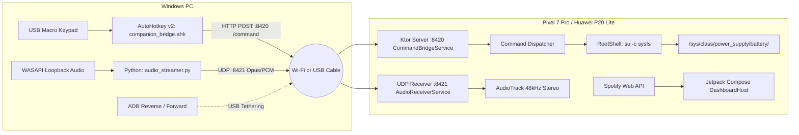

# AGENTS.md — Master Companion AI Architectural Context & Handoff Guide

> **Notice for AI Agents**: This file contains the complete system architecture, hardware topology, UI design rules, codebase layout, and implementation state for the **Master Companion** project. Read this file first to instantly restore full context before making code or architecture changes.

---

## 1. Project Vision & Hardware Topology

Master Companion turns a docked, rooted Android phone (targeted for **Google Pixel 7 Pro**, backward-compatible with **Huawei P20 Lite on Android 9 / API 28**) into a permanent landscape **Smart Desk Standby Dashboard**, hardware monitor, physical macro-pad command receiver, and low-latency wireless/USB audio receiver.

### Hardware & Network Flow


---

## 2. Strict UI/UX Design System Rules

The UI direction was explicitly established with the user:
1. **NO Artificial Glass Boxes / Heavy Glass Panels**: Do NOT add frosted glass cards, rectangular containers, or glossy acrylic boxes around text and controls.
2. **Native Standby / Spotify Car View Aesthetic**:
   - **Background**: Ambient, heavily softened, and dimmed album art filling the screen with an atmospheric radial dark vignette (`Color.Black.copy(alpha = 0.55f)` to `0.88f`).
   - **Left Column**: Prominent square album artwork with soft rounded corners (`16dp` radius) and a floating circular queue button (`Icons.Filled.Menu`) at its bottom-right.
   - **Right Column**:
     - Large bold white track title (`32sp`, bold) and artist (`20sp`, `0.72f` white).
     - Horizontal progress seek bar with solid white indicator, elapsed time (`0:35`), and remaining time (`-3:03`).
     - Large primary playback controls: Skip Back (`|◀◀`), bold Pause/Play (`||`), Skip Next (`▶▶|`).
     - Secondary Action Row: Smart Shuffle (`🔀✨`), Add to Library / Like (`(+)`), Spotify Connect devices (`((•))`), Repeat/Loop (`🔁`).
     - Footer: `^ SPOTIFY` device picker and Volume speaker icon.
     - Bottom Center: Subtle swipeable multi-page pagination dots.
3. **Orientation**: Locked landscape (`screenOrientation="landscape"`).
4. **Display Power**: Immersive mode (system bars hidden via `WindowInsetsControllerCompat.BEHAVIOR_SHOW_TRANSIENT_BARS_BY_SWIPE`), with `FLAG_KEEP_SCREEN_ON` when docked.
5. **OLED Black Standby Mode**: For the Home Clock page, true black `#000000` is mandatory to eliminate backlight glow and prevent burn-in.

---

## 3. Project Directory Map

```
master-companion/
├── AGENTS.md                                           # THIS FILE: Master context for AI agents
├── README.md                                           # Human-facing overview & quickstart
├── build.gradle.kts                                    # Root build script (plugins only)
├── settings.gradle.kts                                 # Repositories & project include
├── gradle.properties                                   # JVM args, AndroidX, caching
├── gradlew.bat                                         # Gradle 8.7 Windows wrapper
├── gradle/
│   ├── libs.versions.toml                              # Central version catalog (AGP 8.5.2, Compose, Ktor, Hilt)
│   └── wrapper/gradle-wrapper.properties               # Points to Gradle 8.7-bin
│
├── docs/                                               # Complete Specifications
│   ├── 01_PRD.md                                       # Product requirements & user stories
│   ├── 02_SRS.md                                       # Technical spec, Ktor API, sysfs paths
│   ├── 03_UI_UX_Architecture.md                        # Design tokens & state architecture
│   ├── 04_Implementation_Plan.md                       # 4 Phased development epics
│   ├── 05_Testing_Strategy.md                          # Testing matrix, unit tests, mock data
│   ├── 06_Error_Handling_Spec.md                       # Offline fallbacks & network reconnect
│   ├── 07_Project_Structure.md                         # Package layout specification
│   └── 08_PC_Companion_Setup.md                        # AHK & Python audio streaming guide
│
├── pc/                                                 # Desktop Utilities (Windows)
│   ├── ahk/
│   │   ├── companion_bridge.ahk                        # AutoHotkey v2 macro bridge script
│   │   └── README.md
│   ├── audio/
│   │   ├── audio_streamer.py                           # Python WASAPI loopback UDP audio streamer
│   │   ├── requirements.txt                            # sounddevice, numpy, opuslib
│   │   └── README.md
│   └── scripts/
│       ├── setup_adb_reverse.bat                       # ADB port reverse (:8420) & forward (:8421)
│       └── test_command_bridge.ps1                     # PowerShell HTTP test client for Ktor server
│
└── app/                                                # Android Native Application
    ├── build.gradle.kts                                # minSdk 28, targetSdk 34, desugaring, Hilt, Ktor
    ├── proguard-rules.pro                              # Proguard rules for Ktor, Netty, Serialization
    └── src/main/
        ├── AndroidManifest.xml                         # Permissions, foreground services, OAuth deep link
        ├── assets/commands.json                        # Default command actions registry
        ├── res/                                        # Material 3 colors, strings, themes, security config
        └── java/com/mastercompanion/
            ├── MasterCompanionApp.kt                   # Application class (@HiltAndroidApp, notification channels)
            ├── MainActivity.kt                         # Landscape entry point hosting DashboardHost()
            │
            ├── domain/model/                           # Immutable domain models
            │   ├── SpotifyTrack.kt                     # Track state, title, artist, artUrl, progress
            │   ├── BatteryData.kt                      # Voltage, current, wattage, bypass status
            │   ├── CommandAction.kt                    # CommandRequest & CommandResponse
            │   └── AudioStreamState.kt                 # UDP receiver stats & latency
            │
            ├── platform/                               # Hardware & OS bridge
            │   ├── DeviceCompat.kt                     # Pixel 7 Pro vs. Huawei P20 Lite sysfs paths
            │   └── root/RootShell.kt                   # su -c command execution & sysfs read/write
            │
            ├── service/                                # Foreground background services
            │   ├── BatteryGuardService.kt              # Sysfs charge monitoring & 80% bypass
            │   ├── CommandBridgeService.kt             # Hosts embedded Ktor HTTP server on :8420
            │   ├── AudioReceiverService.kt             # UDP socket audio receiver on :8421
            │   └── BootReceiver.kt                     # Boots services on BOOT_COMPLETED
            │
            └── ui/
                ├── theme/                              # Color.kt, Type.kt, Theme.kt
                ├── dashboard/
                │   └── DashboardHost.kt                # HorizontalPager multi-page swiping container
                └── home/
                    └── MusicPage.kt                    # Replicated native Spotify landscape player
```

---

## 4. Key Architectural Patterns & Constraints

### A. Android Compatibility & Core Desugaring
* **Target SDK**: 34 (Android 14)
* **Min SDK**: 28 (Android 9 / Huawei P20 Lite)
* **Desugaring**: `coreLibraryDesugaring(libs.desugar.jdk)` is configured in `app/build.gradle.kts` to allow modern `java.time` APIs on Android 9.

### B. Battery & Charging Control (Kernel Sysfs)
* Root access (`su`) is used to directly control charging ICs when the phone is continuously docked:
  * **Pixel 7 Pro (Target)**: `/sys/class/power_supply/battery/charging_enabled` (write `0` to halt charging and run on AC bypass power at 80%).
  * **Huawei P20 Lite (Fallback)**: `/sys/class/power_supply/Battery/charging_enabled` or `/sys/class/power_supply/battery/charge_control_limit_max`.
* Wattage calculation formula:
  $$\text{Power (Watts)} = \frac{\text{Voltage}(\mu V)}{1,000,000} \times \frac{\text{Current}(\mu A)}{1,000,000}$$

### C. Command Bridge (Embedded Ktor HTTP Server)
* Android hosts a lightweight Ktor CIO server on port `8420`.
* **Endpoints**:
  * `GET /ping` → `{"status":"ok"}`
  * `GET /status` → Full JSON status (battery, current track, volume, stream stats).
  * `GET /commands` → List of registered command actions.
  * `POST /command` → Headers: `X-Auth-Token: <token>`. Body: `{"action":"<name>", "params":{...}}`.

### D. Audio Passthrough (UDP Stream)
* PC script `pc/audio/audio_streamer.py` captures WASAPI loopback from Windows and transmits 20ms frames to UDP port `8421`.
* **Packet Header**: `>BII` (1 byte codec: `0x01` PCM, `0x02` Opus; 4 bytes sequence number; 4 bytes timestamp + payload).

---

## 5. Development & Testing Commands

| Purpose | Command |
|---|---|
| **List PC Audio Devices** | `python pc/audio/audio_streamer.py --list-devices` |
| **Start PC Audio Stream** | `python pc/audio/audio_streamer.py --target-ip <PHONE_IP> [--codec pcm]` |
| **Start AHK Macro Bridge** | Run `pc/ahk/companion_bridge.ahk` in AutoHotkey v2 |
| **Setup USB ADB Tethering** | Run `pc/scripts/setup_adb_reverse.bat` |
| **Test Command Bridge HTTP**| `powershell pc/scripts/test_command_bridge.ps1 -Action ping` |
| **Build Android App** | `.\gradlew.bat assembleDebug` |
| **Install App to Phone** | `.\gradlew.bat installDebug` |

---

## 6. Implementation Status & Next Roadmap

### ✅ Completed
- [x] Full product documentation (PRD, SRS, UI/UX, Implementation, Testing, Error Handling, Structure, PC Setup).
- [x] Android Studio & Gradle 8.7 project configuration with version catalogs (`libs.versions.toml`).
- [x] PC Companion scripts (Python audio streamer with WASAPI auto-detection & AHK v2 bridge).
- [x] Android Manifest with foreground services, permissions, and Spotify deep link.
- [x] Platform layer: `RootShell.kt` and `DeviceCompat.kt`.
- [x] Domain models: `SpotifyTrack`, `BatteryData`, `CommandAction`, `AudioStreamState`.
- [x] Service skeletons: `BatteryGuardService`, `CommandBridgeService`, `AudioReceiverService`, `BootReceiver`.
- [x] **Full-Screen Spotify Landscape UI (`MusicPage.kt`)**: Pixel-perfect replication of native car/standby view with ambient blurred album cover, full controls, seekbar, and action buttons.
- [x] **Multi-Page HorizontalPager (`DashboardHost.kt`)**: Swipeable navigation between Home, Music, Audio, and System.

### ⏳ Next Implementation Steps (To be tackled next)
1. **Epic 1.2 (Spotify Web API Integration)**:
   - Implement `SpotifyAuthManager` (OAuth 2.0 PKCE flow with browser launch and deep link capture).
   - Implement Retrofit `SpotifyApi` polling `/v1/me/player/currently-playing` with fallback to `/recently-played`.
2. **Epic 2 (Root Battery Guard Engine)**:
   - Wire `BatteryRepository` with `RootShell` sysfs polling and charge limit threshold enforcement (e.g., auto-halt charging at 80% and resume at 75%).
3. **Epic 3 (Ktor Command Bridge Server)**:
   - Configure Ktor application engine inside `CommandBridgeService` with `CIO`, `ContentNegotiation`, and action routing.
4. **Epic 4 (Audio Receiver Pipeline)**:
   - Complete UDP packet parser, jitter buffer, and `AudioTrack` playback in `AudioReceiverService`.
