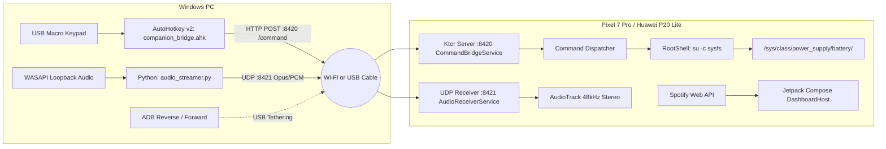

# AGENTS.md — Master Companion AI Architectural Context & Handoff Guide

> 🤖 **Handover Directive for AI Agents & Gemini in Android Studio**:  
> This document is the single source of truth for the **Master Companion** project. It details the complete architecture, hardware topology, strict UI/UX design rules, codebase layout, and the phased roadmap. Read this file first to immediately restore full context before making any code or architecture changes.

---

## 1. Quick Project Summary & Hardware Topology

Master Companion transforms a docked, rooted Android device (optimized for **Google Pixel 7 Pro**, with backward compatibility for **Huawei P20 Lite on Android 9 / API 28**) into a permanent landscape **Smart Desk Standby Dashboard**, hardware monitor, physical macro-pad command receiver, and low-latency wireless/USB audio receiver.

### Hardware & Network Flow


---

## 2. Strict UI/UX Design System Rules

The UI direction was explicitly established with the user:
1. **NO Artificial Glass Boxes / Heavy Glass Panels**: Do NOT wrap text or controls in frosted acrylic containers or glossy glass boxes.
2. **Native Standby / Spotify Car View Aesthetic**:
   - **Background**: Ambient, heavily softened, and dimmed album art filling the screen with an atmospheric radial dark vignette (`Color.Black.copy(alpha = 0.55f)` to `0.88f`).
   - **Left Column**: Prominent square album artwork with soft rounded corners (`16dp` radius) and a floating circular queue button (`Icons.Filled.Menu`) at its bottom-right.
   - **Right Column**:
     - Large bold white track title (`32sp`, bold) and artist (`20sp`, `0.72f` white).
     - Horizontal progress seek bar with solid white indicator, elapsed time (`0:35`), and remaining time (`-3:03`).
     - Large primary playback controls: Skip Back (`|◀◀`), bold Pause/Play (`||`), Skip Next (`▶▶|`).
     - Secondary Action Row: Smart Shuffle (`🔀✨`), Add to Library / Like (`(+)`), Spotify Connect devices (`((•))`), Repeat/Loop (`🔁`).
     - Footer: `^ SPOTIFY` device picker and Volume speaker icon.
     - Bottom Center: Subtle swipeable multi-page pagination dots.
3. **Lyrics Mode Format (Exact Spotify Standby Lyrics View)**:
   - **Top-Left**: Playlist context header with list icon: `PLAYING FROM PLAYLIST` (small, all-caps) and `Liked Songs` (bold white). Tapping exits to standard view.
   - **Left Column**:
     - Square album art (`16dp` rounded corners).
     - Metadata with colored icons: `🎵 Title`, `👤 Artist`, `💿 Album • Year`.
     - Compact red/colored control bar: Heart/Like (`❤️`), Smart Shuffle (`🔀`), Skip Back (`|◀◀`), Play/Pause (`||`), Skip Next (`▶▶|`), Repeat (`🔁`), and Close Lyrics (`✕`).
     - Timestamp (`0:51`), progress seek bar, and duration (`4:54`).
   - **Right Column**:
     - Live karaoke synced lyrics.
     - **Active Singing Line**: Crisp, bold, oversized pure white text (`32sp`).
     - **Upcoming Lines**: Progressively dimmed and optically blurred (`1.5dp` – `3dp` blur with fading opacity) as they cascade downward.
     - **Auto-Scroll**: Keeps the active line smoothly centered with tap-to-seek playback support.
4. **Orientation & Responsiveness**:
   - Primary: Docked landscape mode.
   - Secondary: Adaptive full portrait (vertical) support for handheld use (`android:screenOrientation="fullUser"`).
5. **Background Dynamics**:
   - Seamless 600ms crossfade animation when changing tracks and album artwork.
   - Atmospheric radial dark vignette for high contrast and legibility.
6. **Multiple Presentation Modes**:
   - `STANDARD`: Native Spotify car/standby landscape view.
   - `LYRICS`: Synchronized full-screen lyrics split view.
   - `MINIMAL`: Oversized digital clock (`110sp`) with compact playback telemetry for clean desk clock usage.
7. **OLED Black Standby Mode**: For the Home Clock page, true black `#000000` is mandatory to eliminate backlight glow and prevent burn-in.

---

## 3. Project Directory Map

```
master-companion/
├── AGENTS.md                                           # THIS FILE: Master context for AI agents & Gemini
├── README.md                                           # Human-facing overview & quickstart
├── build.gradle.kts                                    # Root build script (plugins only)
├── settings.gradle.kts                                 # Repositories & project include
├── gradle.properties                                   # JVM args, AndroidX, caching
├── gradlew.bat                                         # Gradle 8.7 Windows wrapper
├── gradle/
│   ├── libs.versions.toml                              # Central version catalog (AGP 8.5.2, Compose, Ktor, Hilt)
│   └── wrapper/gradle-wrapper.properties               # Points to Gradle 8.7-bin
│
├── docs/                                               # Complete Specifications
│   ├── 01_PRD.md                                       # Product requirements & user stories
│   ├── 02_SRS.md                                       # Technical spec, Ktor API, sysfs paths
│   ├── 03_UI_UX_Architecture.md                        # Design tokens & state architecture
│   ├── 04_Implementation_Plan.md                       # 4 Phased development epics
│   ├── 05_Testing_Strategy.md                          # Testing matrix, unit tests, mock data
│   ├── 06_Error_Handling_Spec.md                       # Offline fallbacks & network reconnect
│   ├── 07_Project_Structure.md                         # Package layout specification
│   └── 08_PC_Companion_Setup.md                        # AHK & Python audio streaming guide
│
├── pc/                                                 # Desktop Utilities (Windows)
│   ├── ahk/
│   │   ├── companion_bridge.ahk                        # AutoHotkey v2 macro bridge script
│   │   └── README.md
│   ├── audio/
│   │   ├── audio_streamer.py                           # Python WASAPI loopback UDP audio streamer
│   │   ├── requirements.txt                            # sounddevice, numpy, opuslib
│   │   └── README.md
│   └── scripts/
│       ├── setup_adb_reverse.bat                       # ADB port reverse (:8420) & forward (:8421)
│       └── test_command_bridge.ps1                     # PowerShell HTTP test client for Ktor server
│
└── app/                                                # Android Native Application
    ├── build.gradle.kts                                # minSdk 28, targetSdk 34, desugaring, Hilt, Ktor
    ├── proguard-rules.pro                              # Proguard rules for Ktor, Netty, Serialization
    └── src/main/
        ├── AndroidManifest.xml                         # Permissions, foreground services, OAuth deep link
        ├── assets/commands.json                        # Default command actions registry
        ├── res/                                        # Material 3 colors, strings, themes, security config
        └── java/com/mastercompanion/
            ├── MasterCompanionApp.kt                   # Application class (@HiltAndroidApp, notification channels)
            ├── MainActivity.kt                         # Multi-orientation entry point hosting DashboardHost()
            │
            ├── domain/model/                           # Immutable domain models
            │   ├── SpotifyTrack.kt                     # Track state, title, artist, artUrl, progress, playlistContext
            │   ├── Lyrics.kt                           # LyricLine, TrackLyrics, getCurrentLineIndex() & mocks
            │   ├── BatteryData.kt                      # Voltage, current, wattage, bypass status
            │   ├── CommandAction.kt                    # CommandRequest & CommandResponse
            │   └── AudioStreamState.kt                 # UDP receiver stats & latency
            │
            ├── platform/                               # Hardware & OS bridge
            │   ├── DeviceCompat.kt                     # Pixel 7 Pro vs. Huawei P20 Lite sysfs paths
            │   └── root/RootShell.kt                   # su -c command execution & sysfs read/write
            │
            ├── service/                                # Foreground background services
            │   ├── BatteryGuardService.kt              # Sysfs charge monitoring & 80% bypass
            │   ├── CommandBridgeService.kt             # Hosts embedded Ktor HTTP server on :8420
            │   ├── AudioReceiverService.kt             # UDP socket audio receiver on :8421
            │   └── BootReceiver.kt                     # Boots services on BOOT_COMPLETED
            │
            └── ui/
                ├── theme/                              # Color.kt, Type.kt, Theme.kt
                ├── dashboard/
                │   └── DashboardHost.kt                # HorizontalPager multi-page swiping container
                └── home/
                    ├── MusicPage.kt                    # Replicated native Spotify landscape player + LyricsView
                    ├── LyricsView.kt                   # Progressive blur karaoke lyrics engine
                    └── MusicPlayerLayout.kt            # STANDARD, LYRICS, MINIMAL enum
```

---

## 4. Key Architectural Patterns & Constraints

### A. Android Compatibility & Core Desugaring
* **Target SDK**: 34 (Android 14)
* **Min SDK**: 28 (Android 9 / Huawei P20 Lite)
* **Desugaring**: `coreLibraryDesugaring(libs.desugar.jdk)` is configured in `app/build.gradle.kts` to allow modern `java.time` APIs on Android 9.
* **Architecture**: Jetpack Compose + MVVM / Clean Architecture + Hilt Dependency Injection.

### B. Battery & Charging Control (Kernel Sysfs)
* Root access (`su`) is used to directly control charging ICs when the phone is continuously docked:
  * **Pixel 7 Pro (Target)**: `/sys/class/power_supply/battery/charging_enabled` (write `0` to halt charging and run on AC bypass power at 80%).
  * **Huawei P20 Lite (Fallback)**: `/sys/class/power_supply/Battery/charging_enabled` or `/sys/class/power_supply/battery/charge_control_limit_max`.
* Wattage calculation formula:
  $$\text{Power (Watts)} = \frac{\text{Voltage}(\mu V)}{1,000,000} \times \frac{\text{Current}(\mu A)}{1,000,000}$$

### C. Command Bridge (Embedded Ktor HTTP Server)
* Android hosts a lightweight Ktor CIO server on port `8420`.
* **Endpoints**:
  * `GET /ping` → `{"status":"ok"}`
  * `GET /status` → Full JSON status (battery, current track, volume, stream stats).
  * `GET /commands` → List of registered command actions.
  * `POST /command` → Headers: `X-Auth-Token: <token>`. Body: `{"action":"<name>", "params":{...}}`.

### D. Audio Passthrough (UDP Stream)
* PC script `pc/audio/audio_streamer.py` captures WASAPI loopback from Windows and transmits 20ms frames to UDP port `8421`.
* **Packet Header**: `>BII` (1 byte codec: `0x01` PCM, `0x02` Opus; 4 bytes sequence number; 4 bytes timestamp + payload).
* Android playback uses low-latency `AudioTrack` configured for 48kHz 16-bit stereo PCM.

---

## 5. Phased Implementation Roadmap (For Gemini in Android Studio)

Gemini should execute the remaining codebase in this sequential order:

### Phase 1: Dependency Injection & Preferences Layer
- [ ] Create `app/src/main/java/com/mastercompanion/data/prefs/PreferencesRepository.kt` (DataStore wrapper for auth token, charge limit threshold, PC IP, Spotify tokens).
- [ ] Create Hilt modules:
  - `di/AppModule.kt` (provides ApplicationContext, DataStore, CoroutineDispatchers).
  - `di/NetworkModule.kt` (provides OkHttpClient, Retrofit, Json serializer).
  - `di/RepositoryModule.kt` (binds all repository interfaces).

### Phase 2: Root Battery Guard Engine
- [ ] Create `data/battery/BatteryDataSource.kt` (interface).
- [ ] Create `data/battery/RootBatteryDataSource.kt` (polls sysfs voltage/current via `RootShell.kt`, writes `charging_enabled`).
- [ ] Create `data/battery/StandardBatteryDataSource.kt` (fallback via `BatteryManager` broadcast).
- [ ] Create `data/battery/BatteryRepository.kt` (emits `StateFlow<BatteryData>`, manages 80% charge threshold auto-halt and 75% resume).
- [ ] Wire `service/BatteryGuardService.kt` to run the threshold monitoring loop in the foreground.

### Phase 3: Spotify Web API & OAuth PKCE Engine
- [ ] Create `data/spotify/dto/SpotifyDtos.kt` (DTOs for currently-playing, recently-played, token responses).
- [ ] Create `data/spotify/SpotifyApi.kt` (Retrofit interface for Spotify Web API).
- [ ] Create `data/spotify/SpotifyAuthManager.kt` (OAuth 2.0 PKCE flow: generates `code_verifier` & `code_challenge`, opens custom tab, handles `mastercompanion://spotify/callback`, exchanges token).
- [ ] Create `data/spotify/SpotifyRepository.kt` (polls playback every 1-2s, falls back to recently played, exposes play/pause/skip/seek).

### Phase 4: Embedded Ktor Command Bridge & Network Utilities
- [ ] Create `data/network/WolSender.kt` (broadcasts UDP magic packet on port 9 to wake PC).
- [ ] Create `data/command/CommandRegistry.kt` (parses `assets/commands.json`).
- [ ] Create `data/command/CommandExecutor.kt` (executes actions: `toggle_charge_limit`, `navigate`, `wol`, `audio_toggle`, `set_brightness`, `exec_shell`).
- [ ] Create `server/CommandBridgeServer.kt` (configures Ktor CIO server with ContentNegotiation, status pages, CORS, and auth validation on port 8420).
- [ ] Wire `service/CommandBridgeService.kt` to start/stop the Ktor engine.

### Phase 5: Low-Latency PC Audio Passthrough Receiver
- [ ] Create `data/audio/PacketParser.kt` (unpacks `>BII` header: codec flag, sequence, timestamp).
- [ ] Create `data/audio/JitterBuffer.kt` (smooths packet timing variance).
- [ ] Create `data/audio/AudioPlayer.kt` (manages `AudioTrack` 48kHz stereo stream).
- [ ] Wire `service/AudioReceiverService.kt` to open UDP socket on port 8421 and feed incoming frames to `AudioPlayer`.

### Phase 6: Multi-Page Standby Dashboard UI Suite
- [ ] Create `ui/home/HomePage.kt` (Hero Standby Clock `20:45` + Battery wattage card + charge limit toggle).
- [ ] Create `ui/audio/AudioPage.kt` (PC audio streaming dashboard, live stats: packet rate, loss, latency, volume slider).
- [ ] Create `ui/system/SystemPage.kt` (Hardware monitor, root diagnostic, Ktor HTTP bridge logs).
- [ ] Create `ui/settings/SettingsPage.kt` (Charge limit threshold, Auth Token display/copy, Spotify account login).
- [ ] Wire all 4 pages into `ui/dashboard/DashboardHost.kt` with `HorizontalPager`.

---

## 6. Handover Prompt for Gemini in Android Studio

Copy and paste the prompt below directly into **Gemini inside Android Studio** when you open this project:

```text
Hello Gemini! We are building Master Companion, a landscape Standby Dashboard & PC Bridge app for a rooted Android device (Pixel 7 Pro primary, Huawei P20 Lite API 28 fallback). 

Please read AGENTS.md at the root of the workspace first. It contains our complete architecture, hardware topology, and strict UI rules (NO artificial glass boxes, native Spotify Car View layout, exact lyrics format from user reference screenshots).

All foundational setup, Gradle version catalog (AGP 8.5.2, Compose, Ktor, Hilt), AndroidManifest, services skeletons, domain models, and the full-screen MusicPage.kt with lyrics are already built and committed to Git.

Let's continue following the roadmap in AGENTS.md starting with Phase 1 (Dependency Injection & Preferences Layer: PreferencesRepository.kt and Hilt AppModule/NetworkModule/RepositoryModule) and Phase 2 (Root Battery Guard Engine).
```

---

## 7. Essential Development & Testing Commands

| Purpose | Command |
|---|---|
| **List PC Audio Devices** | `python pc/audio/audio_streamer.py --list-devices` |
| **Start PC Audio Stream** | `python pc/audio/audio_streamer.py --target-ip <PHONE_IP> [--codec pcm]` |
| **Start AHK Macro Bridge** | Run `pc/ahk/companion_bridge.ahk` in AutoHotkey v2 |
| **Setup USB ADB Tethering** | Run `pc/scripts/setup_adb_reverse.bat` |
| **Test Command Bridge HTTP**| `powershell pc/scripts/test_command_bridge.ps1 -Action ping` |
| **Build Android App** | `.\gradlew.bat assembleDebug` |
| **Run Unit Tests** | `.\gradlew.bat testDebugUnitTest` |
| **Install App to Phone** | `.\gradlew.bat installDebug` |
