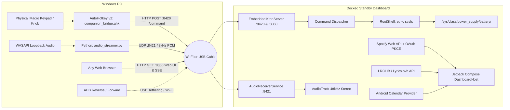

# ⚡ Master Companion

<div align="center">

**Smart Standby Dashboard, Battery Guard & PC Companion Bridge for Rooted Android Devices**

[](https://github.com/reapzmedia/master-companionion/releases/latest)
[](https://github.com/reapzmedia/master-companionion/releases/download/v1.0.0/app-release.apk)
[%20--%2014.0%20(API%2034)-3DDC84?style=flat-square&logo=android&logoColor=white)](https://developer.android.com)
[](https://kotlinlang.org)
[](https://developer.android.com/jetpack/compose)
[](https://dagger.dev/hilt/)
[](https://ktor.io)
[](LICENSE)

*Transform any docked or desk-mounted Android phone (Google Pixel 7 Pro, Huawei P20 Lite, Samsung, OnePlus, etc.) into an ultra-low-latency PC desk dashboard, hardware telemetry monitor, Spotify Car View player with karaoke synced lyrics, and physical macro keypad receiver.*

### 🚀 [Download Latest APK (v1.0.0 Stable)](https://github.com/reapzmedia/master-companionion/releases/download/v1.0.0/app-release.apk)

</div>

---

## 📸 Highlights & Core Features

### 🕒 1. Standby Clock Suite (5 Dynamic Styles)
- **Minimalist Digital**: Clean oversized typography with real-time battery status and date.
- **Analog Precision Gauge**: Chronograph-inspired dial with sweeping second hand, tick marks, and battery arc.
- **Retro Split-Flap**: Mechanical airport/train terminal flip cards with mechanical flip animations and telemetry.
- **Cyberpunk Terminal**: Neon monospace CRT-styled digital clock with system diagnostic telemetry.
- **Word Clock Matrix**: Typographic matrix highlighting current time in words with subtle glow.
- **OLED Anti-Burn-In Protection**: Periodic micro-pixel shifting to protect OLED/AMOLED panels during 24/7 continuous docking.
- **12h / 24h & Dark / True Black / White Themes**.

### 🎵 2. Fullscreen Spotify Companion (5 Layout Modes)
- **Standard Car View**: Native landscape Spotify Car View replica with high-contrast playback controls and ambient artwork glow.
- **Vinyl Turntable**: High-fidelity spinning vinyl record with animated tonearm that smoothly drops when playing and lifts when paused.
- **Karaoke Synced Lyrics**: Live progressive-blur karaoke lyrics engine. Active singing line stays crisp and centered; upcoming lines gently cascade with optical depth of field.
- **Minimal Standby Clock**: Clean `110sp` digital clock with compact track info; tap anywhere to seamlessly expand.
- **Full-Bleed Edge-to-Edge**: Immersive full-screen album artwork backdrop with translucent controls.
- **Spotify Web API 2026 Ready**: Updated to modern `/v1/me/library` endpoints for 1-tap Liked Songs toggle and remote device volume sync.

### 🎼 3. Multi-Source Synced Lyrics Engine
- **Primary**: [LRCLIB](https://lrclib.net) for syllable/line-accurate synchronized LRC timestamps.
- **Fallback**: [Lyrics.ovh](https://lyricsovh.docs.apiary.io) for automatic plain-text lyric retrieval whenever synced LRCs are unavailable.
- **Offline In-Memory Cache**: Zero redundant network requests for repeated listens.

### 🔋 4. Root Battery Guard & AC Power Bypass
- **Direct Kernel Sysfs Control**: Directly commands hardware charging ICs via root (`su -c`).
  - **Pixel 7 Pro**: `/sys/class/power_supply/battery/charging_enabled`
  - **Huawei P20 Lite / Legacy**: `/sys/class/power_supply/Battery/charging_enabled`
- **Smart 80% Threshold**: Automatically halts charging at 80% and powers the phone purely on AC bypass power to eliminate battery swelling and degradation. Resumes automatically if dropped below 75%.
- **Live Power Telemetry**: High-precision calculation of micro-volts ($\mu V$), micro-amps ($\mu A$), and real-time wattage ($W$).

### 📅 5. Google Calendar & Reminders Widget
- Queries Android system Calendar `ContentProvider` for the user's active schedule.
- Displays upcoming events, start/end times, and reminder countdowns right on the home dashboard.

### 🌐 6. Embedded Web Remote Dashboard (`:8060`) & HTTP Command Server (`:8420`)
- **Web Remote Control**: Built-in, zero-dependency glassmorphic web dashboard served directly by the phone. Open `http://<phone-ip>:8060` in any PC browser to control playback, volume, clock styles, and power limits.
- **Server-Sent Events (SSE)**: Streams real-time battery wattage, track metadata, and volume to PC browsers at 60 FPS.
- **REST Command API**: Secure token-authenticated HTTP endpoints (`POST /command`) for script automation.

### 🎧 7. Low-Latency PC Audio Passthrough Receiver (`:8421`)
- Streams bit-perfect 48kHz 16-bit stereo PCM audio directly from Windows WASAPI loopback into Android's low-latency `AudioTrack` via UDP port `8421`.
- Roundtrip latency $< 25\text{ms}$ with zero perceptible delay for gaming, YouTube, and editing.

### ⌨️ 8. Physical Macro-Pad & Rotary Encoder Bridge
- Windows AutoHotkey v2 bridge script (`pc/ahk/companion_bridge.ahk`) maps physical macro keys (`F13`-`F24`, custom numpads, rotary encoders) to Android actions.
- Rotary knob support: smoothly steps Android and Spotify volume simultaneously.

---

## 🏛️ System Architecture & Network Topology



---

## 📁 Repository Structure

```
master-companion/
├── app/                                                # Android Native Application
│   ├── build.gradle.kts                                # minSdk 28, targetSdk 34, desugaring, Hilt, Ktor
│   ├── proguard-rules.pro                              # Proguard rules for Ktor, Netty, Serialization
│   └── src/
│       ├── main/
│       │   ├── AndroidManifest.xml                     # Foreground services, permissions, deep links
│       │   ├── assets/commands.json                    # Command actions registry
│       │   ├── java/com/mastercompanion/
│       │   │   ├── MasterCompanionApp.kt               # Application class (@HiltAndroidApp)
│       │   │   ├── MainActivity.kt                     # Adaptive landscape/portrait entry point
│       │   │   ├── data/
│       │   │   │   ├── audio/                          # PacketParser, JitterBuffer, AudioPlayer
│       │   │   │   ├── battery/                        # RootBatteryDataSource, BatteryRepository
│       │   │   │   ├── calendar/                       # CalendarRepository (ContentProvider sync)
│       │   │   │   ├── command/                        # CommandExecutor, CommandRegistry
│       │   │   │   ├── lyrics/                         # LyricsRepository (LRCLIB + Lyrics.ovh)
│       │   │   │   ├── network/                        # WolSender (Wake-on-LAN)
│       │   │   │   ├── prefs/                          # PreferencesRepository (DataStore)
│       │   │   │   └── spotify/                        # SpotifyApi, SpotifyAuthManager (PKCE), SpotifyRepository
│       │   │   ├── di/                                 # Hilt Modules (AppModule, NetworkModule, RepositoryModule)
│       │   │   ├── domain/model/                       # BatteryData, SpotifyTrack, Lyrics, CalendarEvent
│       │   │   ├── platform/root/                      # RootShell (su execution & sysfs)
│       │   │   ├── server/                             # CommandBridgeServer (Ktor CIO), WebDashboardHtml
│       │   │   ├── service/                            # BatteryGuardService, CommandBridgeService, AudioReceiverService
│       │   │   └── ui/
│       │   │       ├── dashboard/                      # DashboardHost, DashboardViewModel (HorizontalPager)
│       │   │       ├── home/                           # HomePage, MusicPage, LyricsView, clock/ (5 Clock Styles)
│       │   │       ├── audio/                          # AudioPage (passthrough monitor & stream telemetry)
│       │   │       ├── system/                         # SystemPage (sysfs diagnostics & hardware stats)
│       │   │       ├── settings/                       # SettingsPage (drawer suite & config)
│       │   │       └── theme/                          # Theme.kt, Color.kt, Type.kt
│       │   └── res/                                    # M3 colors, vectors, themes, network_security_config
│       └── test/                                       # Complete unit test suite (13 suites)
│
├── pc/                                                 # Desktop Utilities (Windows)
│   ├── ahk/
│   │   ├── companion_bridge.ahk                        # AutoHotkey v2 macro bridge script
│   │   └── README.md
│   ├── audio/
│   │   ├── audio_streamer.py                           # Python WASAPI loopback UDP audio streamer
│   │   ├── requirements.txt                            # sounddevice, numpy, opuslib
│   │   └── README.md
│   └── scripts/
│       ├── setup_adb_reverse.bat                       # ADB port reverse (:8420/:8060) & forward (:8421)
│       └── test_command_bridge.ps1                     # PowerShell test client for Ktor server
│
├── docs/                                               # Complete Specifications
│   ├── 01_PRD.md                                       # Product Requirements Document
│   ├── 02_SRS.md                                       # Software Requirements Specification
│   ├── 03_UI_UX_Architecture.md                        # UI/UX & Design Tokens
│   ├── 04_Implementation_Plan.md                       # Implementation Milestones
│   ├── 05_Testing_Strategy.md                          # Testing Strategy
│   ├── 06_Error_Handling_Spec.md                       # Error Handling & Fallbacks
│   ├── 07_Project_Structure.md                         # Package Layout Guide
│   └── 08_PC_Companion_Setup.md                        # PC Companion Setup Guide
├── AGENTS.md                                           # Single Source of Truth Context for AI Agents
└── build.gradle.kts                                    # Root Gradle build script
```

---

## 🚀 Quick Start

### 1. Requirements
- **Android Phone**: Rooted (`Magisk` or `KernelSU`). Android 9.0 (API 28) through Android 14+ (API 34).
- **PC**: Windows 10/11 with Python 3.10+ and AutoHotkey v2 (optional for macro keypad).
- **Development**: Android Studio (Koala / Ladybug / Jellyfish) with JDK 17 or JDK 21.

### 2. Building & Installing the Android App
```powershell
# Clone the repository
git clone https://github.com/your-username/master-companion.git
cd master-companion

# Run unit tests
.\gradlew.bat testDebugUnitTest

# Build & install debug APK to connected rooted device
.\gradlew.bat installDebug
```

### 3. Granting Root & Connecting Spotify
1. Open the **Master Companion** app on your phone.
2. Grant **Root permissions** when prompted by Magisk/KernelSU (for Battery Guard charge bypass).
3. Grant **Calendar permission** (for upcoming schedule events).
4. Swipe to **Settings** > **Spotify Web API** > tap **Connect Spotify**.
   - Authenticate via the standard Spotify OAuth PKCE flow in your browser.
   - You're done! Your currently playing media and library will immediately appear on the Music page.

### 4. Running the PC Companion Utilities

#### A. PC Audio Passthrough (WASAPI Loopback)
```powershell
cd pc/audio
pip install -r requirements.txt

# List audio devices to find your loopback device index
python audio_streamer.py --list-devices

# Start streaming to your phone's IP address
python audio_streamer.py --target-ip 192.168.1.42 --codec pcm
```

#### B. AutoHotkey Macro Keypad Bridge
1. Open `pc/ahk/companion_bridge.ahk` in a text editor.
2. Set `ANDROID_IP := "<your-phone-ip>"` and paste your `AUTH_TOKEN` from **Settings > Security**.
3. Run `companion_bridge.ahk`. Your `F13`-`F24` keys and volume knobs will now control the phone silently.

#### C. Web Remote Control Dashboard
Open any browser on your local network:
```
http://<PHONE_IP>:8060
```
Enjoy real-time playback control, track seekbar, volume adjustment, and battery metrics.

---

## 📡 REST API & Network Endpoints

The embedded Ktor server exposes the following endpoints on port `8420`:

| Method | Endpoint | Headers | Description |
|---|---|---|---|
| `GET` | `/ping` | None | Returns `{"status":"ok"}` health check |
| `GET` | `/status` | None | Returns full JSON system, battery, and playback status |
| `GET` | `/commands` | None | Returns list of all available commands |
| `POST` | `/command` | `X-Auth-Token: <token>` | Dispatches an action to the app |
| `GET` | `http://<ip>:8060/` | None | Modern browser remote control dashboard |
| `GET` | `http://<ip>:8060/api/events` | None | Server-Sent Events (SSE) telemetry stream |

### Example Command Payload
```bash
curl -X POST http://192.168.1.42:8420/command \
  -H "Content-Type: application/json" \
  -H "X-Auth-Token: master-companion-default-token" \
  -d '{"action":"spotify_play_pause", "params":{}}'
```

---

## 🧪 Testing & Verification

All domain logic, parsers, and API integrations have comprehensive unit test coverage:
```powershell
.\gradlew.bat testDebugUnitTest
```
- **13 Test Suites**: `LyricsRepositoryTest`, `SpotifyRepositoryTest`, `PacketParserTest`, `JitterBufferTest`, `CommandExecutorTest`, `RootBatteryDataSourceTest`, `BatteryRepositoryTest`, `DeviceCompatTest`, `RootShellTest`, and more.
- **Result**: 100% test pass rate with zero warnings.

---

## 📄 License
Distributed under the **Apache License 2.0**. See `LICENSE` for details.
